Group 1 Project 1 Tutorial
================
2024-09-29

Tutorial: An Introduction to Data Preparation, Exploration, and Analysis

## Target Audience

Our target audience for this project are fellow BIOL 364 students.
Students in this class generally have had a brief introduction or
previous exposure to R software. Therefore, the goal of this proposal is
to walk students though a data modeling tutorial, including basic R
housekeeping, but not go extremely in-depth in the explanation for all
coding language. This tutorial assumes the individual has some previous
R experience.

## Tutorial introduction

Do you have a dataset but you’re not sure where to start with analysis?
This tutorial is for you! Utilizing an Iris data set, you will start by
learning how to import, classify, and organize your data to prepare it
for use. You will then perform some base level data exploration by
looking at your variable’s distributions assessing for normalcy, and
transforming as necessary. Finally, you will develop and explore a
question about the relationships between the variables presented in the
data. Using this question, you will learn some of the different
statistical tests that can be run, why these tests are run, and data
visualization.

## Tutorial objectives

There are three objectives for this tutorial:

1.  Understand how to classify data (understanding different variable
    types and its effect on how to use them in analysis).
2.  Review loading data, organizing data, and preparing data for
    statistical analysis.
3.  Explain the conditions required for using linear modeling, t.tests,
    or ANOVA tests to analyze data.

## Data introduction

The data set used in this tutorial contains data for members of three
different species of Iris. This is an expanded version of a very popular
introductory dataset. It features morphometric data highlighting the
petals and sepals of *Iris* flowers. Petals being the colored modified
leaves that surround the reproductive parts of the flower and sepals
being the typically green leaf like structures that protect the flower
bud and provide support for the petals when the flower is in bloom. The
data set also records the elevation and soil type where the flowers are
found. There are 1200 observations in the data set with 400 observations
per species.

# Getting Set up

## Loading the necessary packages

``` r
if (!require("UsingR")) install.packages("UsingR"); 
```

    ## Loading required package: UsingR

    ## Loading required package: MASS

    ## Loading required package: HistData

    ## Loading required package: Hmisc

    ## 
    ## Attaching package: 'Hmisc'

    ## The following objects are masked from 'package:base':
    ## 
    ##     format.pval, units

``` r
  library(UsingR) # For the simple.eda function
if (!require("GGally")) install.packages("GGally");
```

    ## Loading required package: GGally

    ## Loading required package: ggplot2

    ## Registered S3 method overwritten by 'GGally':
    ##   method from   
    ##   +.gg   ggplot2

``` r
if (!require("cowplot")) install.packages("cowplot"); 
```

    ## Loading required package: cowplot

``` r
  library(cowplot) # For graphing aesthetics
if (!require("conflicted")) install.packages("conflicted"); 
```

    ## Loading required package: conflicted

``` r
  library (conflicted) # For conflicts
if (!require("readxl")) install.packages("readxl"); 
```

    ## Loading required package: readxl

``` r
  library(readxl) #To read in data
if (!require("gplots")) install.packages("gplots"); 
```

    ## Loading required package: gplots

``` r
  library(gplots) #For graphs/plots
if (!require("tidyverse")) install.packages("tidyverse"); 
```

    ## Loading required package: tidyverse

    ## ── Attaching core tidyverse packages ──────────────────────── tidyverse 2.0.0 ──
    ## ✔ dplyr     1.1.4     ✔ readr     2.1.5
    ## ✔ forcats   1.0.0     ✔ stringr   1.5.1
    ## ✔ lubridate 1.9.3     ✔ tibble    3.2.1
    ## ✔ purrr     1.0.2     ✔ tidyr     1.3.1

``` r
  library(tidyverse) # Always download this!
conflict_prefer_all("dplyr", quiet = TRUE)
```

## Importing the dataset

There are two ways you could go about downloading the data set. First,
try this script which should download it directly from our Git folder:

``` r
library (readr)
iris.raw.data <- read.csv(url("https://raw.githubusercontent.com/Bucknell-Biol364/Project_1_Group_1_2024/refs/heads/main/Final%20Folder/iris_extended.csv"))
```

If that does not work, go to our Git repository called
Project_1_Group_1_2024, and download the “iris.extended.csv” data file
from the “Final” folder.

``` r
iris.raw.data <- read.csv("iris_extended.csv")
```

*Citation for the dataset:
<https://www.kaggle.com/datasets/samybaladram/iris-dataset-extended?select=iris_extended.csv>*

After loading in a dataset, you always want to make sure that everything
loaded in properly. To do this, check the top and bottom of your data
(head() and tail()), and the number of observations you have imported
(nrow()). The data on GitHub reports 1200 lines of data, in our
environment the data should read 1200 observations as there is one line
for column headings.

``` r
head(iris.raw.data)
```

    ##   species elevation soil_type sepal_length sepal_width petal_length petal_width
    ## 1  setosa     161.8     sandy         5.16        3.41         1.64        0.26
    ## 2  setosa     291.4      clay         5.48        4.05         1.53        0.37
    ## 3  setosa     144.3     sandy         5.10        2.80         1.47        0.38
    ## 4  setosa     114.6      clay         4.64        3.44         1.53        0.17
    ## 5  setosa     110.9     loamy         4.85        2.87         1.23        0.26
    ## 6  setosa     164.4      clay         4.91        3.19         1.86        0.35
    ##   sepal_area petal_area sepal_aspect_ratio petal_aspect_ratio
    ## 1    17.5956     0.4264           1.513196           6.307692
    ## 2    22.1940     0.5661           1.353086           4.135135
    ## 3    14.2800     0.5586           1.821429           3.868421
    ## 4    15.9616     0.2601           1.348837           9.000000
    ## 5    13.9195     0.3198           1.689895           4.730769
    ## 6    15.6629     0.6510           1.539185           5.314286
    ##   sepal_to_petal_length_ratio sepal_to_petal_width_ratio
    ## 1                    3.146341                  13.115385
    ## 2                    3.581699                  10.945946
    ## 3                    3.469388                   7.368421
    ## 4                    3.032680                  20.235294
    ## 5                    3.943089                  11.038462
    ## 6                    2.639785                   9.114286
    ##   sepal_petal_length_diff sepal_petal_width_diff petal_curvature_mm
    ## 1                    3.52                   3.15               5.33
    ## 2                    3.95                   3.68               5.90
    ## 3                    3.63                   2.42               5.66
    ## 4                    3.11                   3.27               4.51
    ## 5                    3.62                   2.61               4.03
    ## 6                    3.05                   2.84               6.18
    ##   petal_texture_trichomes_per_mm2 leaf_area_cm2 sepal_area_sqrt petal_area_sqrt
    ## 1                           18.33         53.21        4.194711       0.6529931
    ## 2                           20.45         52.53        4.711051       0.7523962
    ## 3                           24.62         50.25        3.778889       0.7473955
    ## 4                           22.91         50.85        3.995197       0.5100000
    ## 5                           21.56         40.57        3.730885       0.5655086
    ## 6                           18.52         48.14        3.957638       0.8068457
    ##   area_ratios
    ## 1    41.26548
    ## 2    39.20509
    ## 3    25.56391
    ## 4    61.36717
    ## 5    43.52564
    ## 6    24.05975

``` r
tail(iris.raw.data)
```

    ##        species elevation soil_type sepal_length sepal_width petal_length
    ## 1195 virginica     157.5     loamy         5.80        1.93         4.81
    ## 1196 virginica     268.8     loamy         5.36        2.51         5.16
    ## 1197 virginica     125.4      clay         7.49        3.06         7.68
    ## 1198 virginica      73.6      clay         6.79        3.25         4.72
    ## 1199 virginica     239.6     sandy         6.38        2.24         5.30
    ## 1200 virginica     201.5     loamy         5.16        3.20         5.64
    ##      petal_width sepal_area petal_area sepal_aspect_ratio petal_aspect_ratio
    ## 1195        2.03    11.1940     9.7643           3.005181           2.369458
    ## 1196        1.93    13.4536     9.9588           2.135458           2.673575
    ## 1197        2.17    22.9194    16.6656           2.447712           3.539171
    ## 1198        2.26    22.0675    10.6672           2.089231           2.088496
    ## 1199        1.71    14.2912     9.0630           2.848214           3.099415
    ## 1200        1.43    16.5120     8.0652           1.612500           3.944056
    ##      sepal_to_petal_length_ratio sepal_to_petal_width_ratio
    ## 1195                   1.2058212                  0.9507389
    ## 1196                   1.0387597                  1.3005181
    ## 1197                   0.9752604                  1.4101382
    ## 1198                   1.4385593                  1.4380531
    ## 1199                   1.2037736                  1.3099415
    ## 1200                   0.9148936                  2.2377622
    ##      sepal_petal_length_diff sepal_petal_width_diff petal_curvature_mm
    ## 1195                    0.99                  -0.10               7.26
    ## 1196                    0.20                   0.58              11.61
    ## 1197                   -0.19                   0.89              13.85
    ## 1198                    2.07                   0.99              13.13
    ## 1199                    1.08                   0.53              11.01
    ## 1200                   -0.48                   1.77              12.09
    ##      petal_texture_trichomes_per_mm2 leaf_area_cm2 sepal_area_sqrt
    ## 1195                            8.95         70.22        3.345744
    ## 1196                           11.52         59.46        3.667915
    ## 1197                            6.99         77.12        4.787421
    ## 1198                            9.16         74.39        4.697606
    ## 1199                            6.46         73.90        3.780370
    ## 1200                            8.59         64.31        4.063496
    ##      petal_area_sqrt area_ratios
    ## 1195        3.124788    1.146421
    ## 1196        3.155757    1.350926
    ## 1197        4.082352    1.375252
    ## 1198        3.266068    2.068725
    ## 1199        3.010482    1.576873
    ## 1200        2.839930    2.047314

``` r
nrow(iris.raw.data)
```

    ## [1] 1200

This shows us that there are 1200 rows of data which aligns with the
expectation of 1200 lines of data according to Github.

## Summarizing the data

It is important to understand the structure of the raw data as it will
impact how you prepare for analysis. To do so, use the glimpse()
function which summarizes the general structure of the dataset:

``` r
glimpse(iris.raw.data)
```

    ## Rows: 1,200
    ## Columns: 21
    ## $ species                         <chr> "setosa", "setosa", "setosa", "setosa"…
    ## $ elevation                       <dbl> 161.8, 291.4, 144.3, 114.6, 110.9, 164…
    ## $ soil_type                       <chr> "sandy", "clay", "sandy", "clay", "loa…
    ## $ sepal_length                    <dbl> 5.16, 5.48, 5.10, 4.64, 4.85, 4.91, 4.…
    ## $ sepal_width                     <dbl> 3.41, 4.05, 2.80, 3.44, 2.87, 3.19, 3.…
    ## $ petal_length                    <dbl> 1.64, 1.53, 1.47, 1.53, 1.23, 1.86, 1.…
    ## $ petal_width                     <dbl> 0.26, 0.37, 0.38, 0.17, 0.26, 0.35, 0.…
    ## $ sepal_area                      <dbl> 17.5956, 22.1940, 14.2800, 15.9616, 13…
    ## $ petal_area                      <dbl> 0.4264, 0.5661, 0.5586, 0.2601, 0.3198…
    ## $ sepal_aspect_ratio              <dbl> 1.513196, 1.353086, 1.821429, 1.348837…
    ## $ petal_aspect_ratio              <dbl> 6.307692, 4.135135, 3.868421, 9.000000…
    ## $ sepal_to_petal_length_ratio     <dbl> 3.146341, 3.581699, 3.469388, 3.032680…
    ## $ sepal_to_petal_width_ratio      <dbl> 13.115385, 10.945946, 7.368421, 20.235…
    ## $ sepal_petal_length_diff         <dbl> 3.52, 3.95, 3.63, 3.11, 3.62, 3.05, 3.…
    ## $ sepal_petal_width_diff          <dbl> 3.15, 3.68, 2.42, 3.27, 2.61, 2.84, 3.…
    ## $ petal_curvature_mm              <dbl> 5.33, 5.90, 5.66, 4.51, 4.03, 6.18, 6.…
    ## $ petal_texture_trichomes_per_mm2 <dbl> 18.33, 20.45, 24.62, 22.91, 21.56, 18.…
    ## $ leaf_area_cm2                   <dbl> 53.21, 52.53, 50.25, 50.85, 40.57, 48.…
    ## $ sepal_area_sqrt                 <dbl> 4.194711, 4.711051, 3.778889, 3.995197…
    ## $ petal_area_sqrt                 <dbl> 0.6529931, 0.7523962, 0.7473955, 0.510…
    ## $ area_ratios                     <dbl> 41.26548, 39.20509, 25.56391, 61.36717…

Now when it comes to learning the more common variable types after you
run the glimpse function here is what you will typically see in the
second column.

**\< int \>:** Represents integers, whole numbers like 1, 42, or -5.

- Example: 5, 100, -3

**\< dbl \>:** Represents double (numeric) values, which are real
numbers (can have decimals).

- Example: 3.14, -1.23, 0.001

**\< chr \>:** Represents character strings or text data.

- Example: “apple”, “hello world”, “2024”

**\< lgl \>:** Represents logical values, which can be TRUE, FALSE, or
NA (missing value).

- Example: TRUE, FALSE, NA

**\< fctr \>:** Represents factor variables, which are categorical data
with a fixed set of levels.

- Example: Low, Medium, High (ordered or unordered categories)

**\< date \>:** Represents date objects, specifically dates in the
format YYYY-MM-DD.

- Example: 2024-10-07

**\< time \>:** Represents time or date-time objects, usually in the
format YYYY-MM-DD HH:MM:SS.

- Example: 2024-10-07 12:34:56

**\< list \>:** Represents a list, a flexible data type in R that can
hold multiple types of data structures (like vectors, data frames, or
even other lists).

- Example: A list can contain elements like vectors, matrices, or other
  lists.

**\< POSIXct \>:** Represents date-time objects that store both date and
time information. These are particularly useful for time series data.

- Example: 2024-10-07 14:30:00

**\< num \>:** Represents numeric values, which can be both integers and
real numbers (similar to <dbl> but more general).

- Example: 3.0, -1, 42.5

## Check for NAs in the data

We should now start to clean our data set. One of the first things we
can do is check for for NAs in the data set. NAs within the data mean
that there are missing data values. Missing data values can make the row
containing the NA less useful to us as the missing information could
skew our tests. It is important to consider how dropping NAs might
affect your analysis, for instance is the NA in a section of the data
that you are not looking to analyze? Consider the possible reasons you
might want or not want to drop NAs before doing so. In this dataset
there are no NAs. If there were though and we did want to remove them,
we could use the function `drop_na()` to omit those rows.

# Looking into different variables

If you are ever looking at a data set and you find it hard to understand
what type of variables you are looking at here is a few simple ways to
get a bettering understanding. In th code chuck above there is a code
used called “glimpse”. There are typically two variables that we look at
when conducting data exploration which are response and explanatory.

**Explanatory:** Also known as an independent variable or predictor,
this variable is used to explain or predict the outcome variable. It’s
the expected cause of the response variable.

- Ex: Elevation

**Response:** Also known as a dependent variable, this variable is the
outcome variable that’s explained or predicted by the explanatory
variable. It’s the expected effect of the explanatory variable.

- Ex: sepal_length, sepal_width, petal_length, petal_width, sepal_area,
  , sepal_aspect_ratio, petal_aspect_ratio, sepal_to_petal_length_ratio,
  sepal_to_petal_length_diff, sepal_to_petal_width_diff,
  petal_curvature_mm, petal_texture_trichomes_per_mm2, leaf_area_cm2,
  sepal_area_sprt, petal_area_sprt, area_ratios

**Factoring:** the process of converting a variable into a factor, which
is a data type used to represent categorical data. Factors store both
the unique categories (called levels) and the values that belong to
those categories. Factoring is commonly used when you want to classify
data into distinct groups, such as types, species, or categories, for
statistical modeling or analysis.

We can change our categorial functions into factors by running the code
chunk below. The mutate function allows one to manipulate previously
existing variables in a dataframe (i.e. change a variable into a factor
as demonstrated below). The mutate() function can be used to manipulate
pre-existing variables or generate new columns of data.

``` r
iris.raw.data <- iris.raw.data |> 
  mutate(soil_type = as.factor(soil_type),
         species = as.factor(species))

summary(iris.raw.data$soil_type)
```

    ##  clay loamy sandy 
    ##   444   403   353

``` r
summary(iris.raw.data$species)
```

    ##     setosa versicolor  virginica 
    ##        400        400        400

After running this code, both the soil_type and species columns will be
stored as factors in the iris.raw.data dataset, making it easier to
perform tasks like grouping, summarization, or statistical modeling that
depend on categorical variables.

Lets check our dataset to make sure all of our variables are now
classified as we would want them to be:

``` r
glimpse(iris.raw.data)
```

    ## Rows: 1,200
    ## Columns: 21
    ## $ species                         <fct> setosa, setosa, setosa, setosa, setosa…
    ## $ elevation                       <dbl> 161.8, 291.4, 144.3, 114.6, 110.9, 164…
    ## $ soil_type                       <fct> sandy, clay, sandy, clay, loamy, clay,…
    ## $ sepal_length                    <dbl> 5.16, 5.48, 5.10, 4.64, 4.85, 4.91, 4.…
    ## $ sepal_width                     <dbl> 3.41, 4.05, 2.80, 3.44, 2.87, 3.19, 3.…
    ## $ petal_length                    <dbl> 1.64, 1.53, 1.47, 1.53, 1.23, 1.86, 1.…
    ## $ petal_width                     <dbl> 0.26, 0.37, 0.38, 0.17, 0.26, 0.35, 0.…
    ## $ sepal_area                      <dbl> 17.5956, 22.1940, 14.2800, 15.9616, 13…
    ## $ petal_area                      <dbl> 0.4264, 0.5661, 0.5586, 0.2601, 0.3198…
    ## $ sepal_aspect_ratio              <dbl> 1.513196, 1.353086, 1.821429, 1.348837…
    ## $ petal_aspect_ratio              <dbl> 6.307692, 4.135135, 3.868421, 9.000000…
    ## $ sepal_to_petal_length_ratio     <dbl> 3.146341, 3.581699, 3.469388, 3.032680…
    ## $ sepal_to_petal_width_ratio      <dbl> 13.115385, 10.945946, 7.368421, 20.235…
    ## $ sepal_petal_length_diff         <dbl> 3.52, 3.95, 3.63, 3.11, 3.62, 3.05, 3.…
    ## $ sepal_petal_width_diff          <dbl> 3.15, 3.68, 2.42, 3.27, 2.61, 2.84, 3.…
    ## $ petal_curvature_mm              <dbl> 5.33, 5.90, 5.66, 4.51, 4.03, 6.18, 6.…
    ## $ petal_texture_trichomes_per_mm2 <dbl> 18.33, 20.45, 24.62, 22.91, 21.56, 18.…
    ## $ leaf_area_cm2                   <dbl> 53.21, 52.53, 50.25, 50.85, 40.57, 48.…
    ## $ sepal_area_sqrt                 <dbl> 4.194711, 4.711051, 3.778889, 3.995197…
    ## $ petal_area_sqrt                 <dbl> 0.6529931, 0.7523962, 0.7473955, 0.510…
    ## $ area_ratios                     <dbl> 41.26548, 39.20509, 25.56391, 61.36717…

**Understanding Check!:**

What would these variables be classified as? Would you want to mutate
them at all? If so, why?

- sepal_to_petal_width_ratio:
- Soil_type:
- petal_area:
- Species:

# Exploratory Data Analysis

It is important to run an initial exploratory data analysis to
understand the distributions of your dataset as the distribution of data
directly influences the type of statistical analyses to perform.

## Checking Distributions

To explore the distributions of some of the variables we are interested
in we can use the simple.eda() function to look at the distributions of
the numerical data. The simple.eda() function uses a histogram, boxplot,
and Q-Q plot to provide a visual representation of the distribution of
one’s data. When looking at the results for the simple.eda() function,
look for characteristics of a normal distribution such as bell-shaped
curve for the histogram, an unskewed boxplot in which the box is
equidistant from each end of the whiskers, a central median line in the
boxplot, and data points in the Q-Q plot that align the theoretical
line. These characteristics represent normality.

``` r
simple.eda(iris.raw.data$sepal_area)
```

<!-- -->

``` r
simple.eda(iris.raw.data$sepal_length)
```

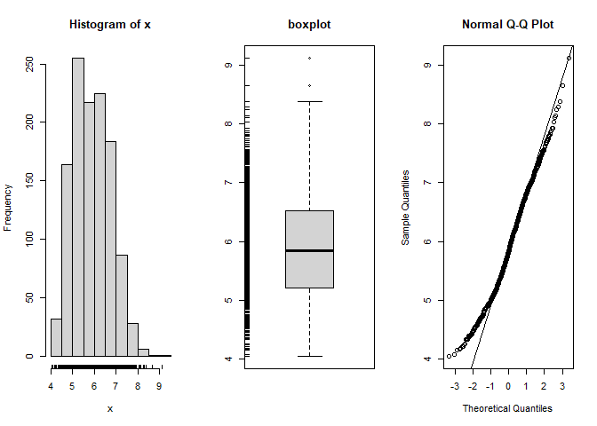<!-- -->

``` r
simple.eda(iris.raw.data$sepal_width)
```

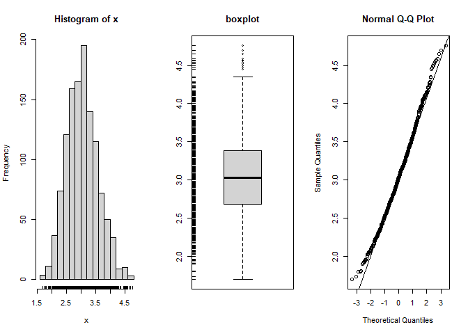<!-- -->

``` r
simple.eda(iris.raw.data$petal_width)
```

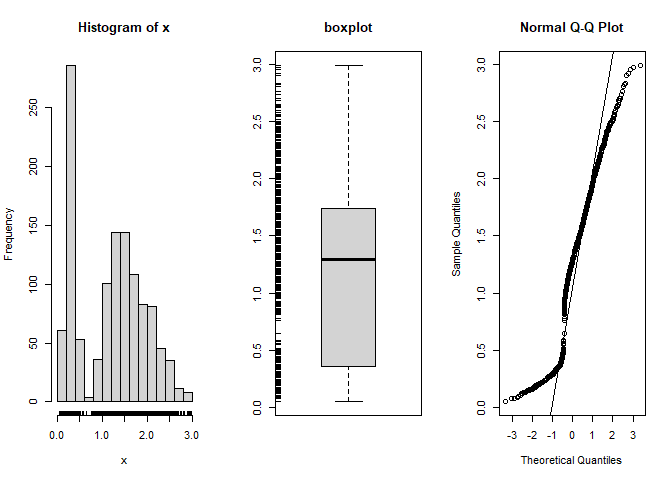<!-- -->

``` r
simple.eda(iris.raw.data$petal_length)
```

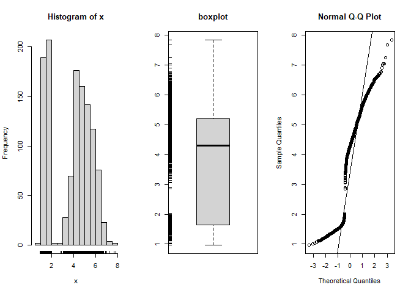<!-- -->

``` r
simple.eda(iris.raw.data$petal_area)
```

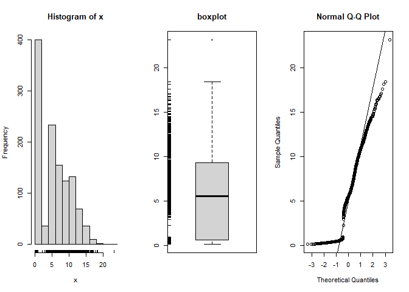<!-- -->

The results of this preliminary analysis shows that sepal area and sepal
width are approximately normally distributed as their histograms follow
a bell shaped curve. The other variables sepal length, petal width,
petal length, and petal area are not normally distributed as their
histograms are skewed and their boxplots are skewed. Also, their data
does not align well with the theoretical line in the Q-Q plot.

To confirm the distributions of the dataset, we are going to use a
Shapiro test for normality. To determine normality, if the p-value
produced by a Shapiro test is greater than the confidence level alpha =
0.05, the distribution is normal. If the p-value produced by the Shapiro
test is less than the confidence level alpha = 0.05, the data is not
normally distributed.

``` r
shapiro.test(iris.raw.data$sepal_area)
```

    ## 
    ##  Shapiro-Wilk normality test
    ## 
    ## data:  iris.raw.data$sepal_area
    ## W = 0.99111, p-value = 1.208e-06

``` r
shapiro.test(iris.raw.data$sepal_width)
```

    ## 
    ##  Shapiro-Wilk normality test
    ## 
    ## data:  iris.raw.data$sepal_width
    ## W = 0.99337, p-value = 3.396e-05

``` r
shapiro.test(iris.raw.data$sepal_length)
```

    ## 
    ##  Shapiro-Wilk normality test
    ## 
    ## data:  iris.raw.data$sepal_length
    ## W = 0.98401, p-value = 3.215e-10

``` r
shapiro.test(iris.raw.data$petal_length)
```

    ## 
    ##  Shapiro-Wilk normality test
    ## 
    ## data:  iris.raw.data$petal_length
    ## W = 0.88769, p-value < 2.2e-16

``` r
shapiro.test(iris.raw.data$petal_area)
```

    ## 
    ##  Shapiro-Wilk normality test
    ## 
    ## data:  iris.raw.data$petal_area
    ## W = 0.91375, p-value < 2.2e-16

``` r
shapiro.test(iris.raw.data$petal_width)
```

    ## 
    ##  Shapiro-Wilk normality test
    ## 
    ## data:  iris.raw.data$petal_width
    ## W = 0.93112, p-value < 2.2e-16

The results of the Shapiro test show that all six variables do not
follow a normal distribution as the p-values produced by the Shapiro
test are lower than the confidence level alpha = 0.05. Therefore, to
prepare the data for statistical analysis, we will log transform the
data to fit the data into a normal distribution.

## Log Transform the Data

The code below log transforms the raw data to achieve normality. After
log transforming the data, confirm the results using the simple.eda()
function again.

``` r
iris.raw.data$log10sepal_length <- log10(iris.raw.data$sepal_length)
simple.eda(iris.raw.data$log10sepal_length)
```

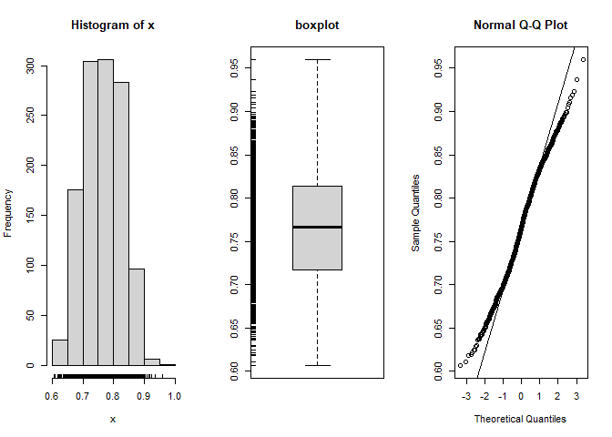<!-- -->

``` r
iris.raw.data$log10sepal_width <- log10(iris.raw.data$sepal_width)
simple.eda(iris.raw.data$log10sepal_width)
```

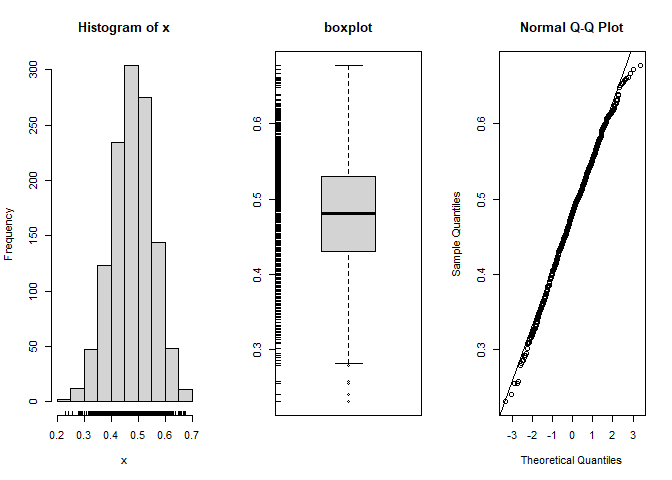<!-- -->

``` r
iris.raw.data$log10petal_length <- log10(iris.raw.data$petal_length)
simple.eda(iris.raw.data$log10petal_length)
```

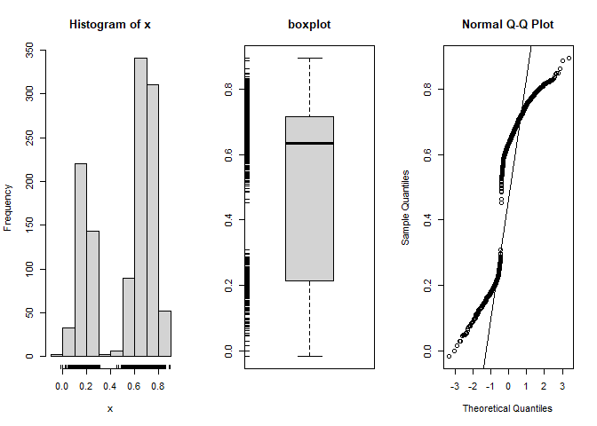<!-- -->

``` r
iris.raw.data$log10petal_width <- log10(iris.raw.data$petal_width)
simple.eda(iris.raw.data$log10petal_width)
```

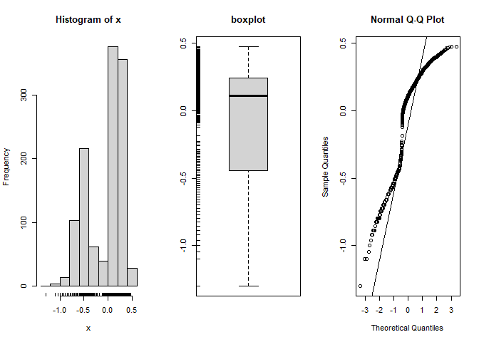<!-- -->

After log transforming the sepal length data, we find that it now
follows a normal distribution. It is important for a dataset to be
normally distributed for parametric tests as parametric tests use means
to calculate statistical differences. Therefore, means need to be
appropriately representative for a given data set, provided by a normal
distribution. For instance, a mean from a given population that is
skewed is not accurately representative of the data.

After log transforming the petal length data, we found that it did not
convert into a normal distribution. What aspect of the data do think is
driving this? After reflection, please see below for an explanation!

## Filter the data by species:

The filter() function allows one to separate and isolate specific data
for analysis. Filtering may help organize a dataset because it allows
one to extract data that aligns with one’s inclusion criteria. Below,
the tutorial filters the iris data into separate species with the names
of each species serving as the inclusion criteria for that given filter.

``` r
setosa_data <- iris.raw.data |> 
  filter(species=="setosa")

versicolor_data <- iris.raw.data |>
  filter(species=="versicolor")

virginica_data <- iris.raw.data |>
  filter(species=="virginica")
```

Now, look at petal length for all three iris species separately:

``` r
simple.eda(setosa_data$log10petal_length)
```

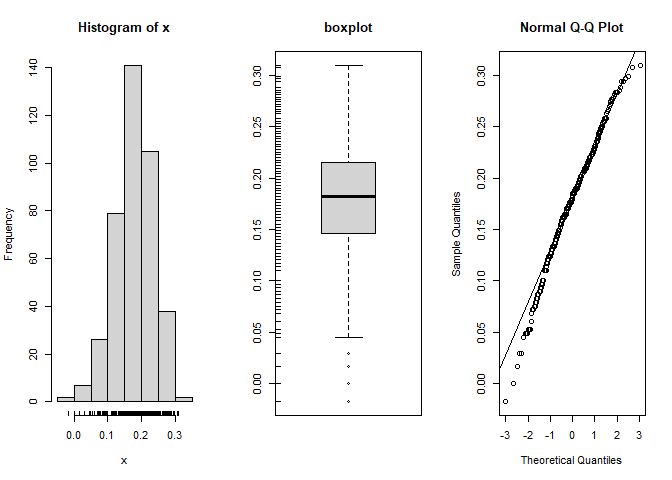<!-- -->

``` r
simple.eda(versicolor_data$log10petal_length)
```

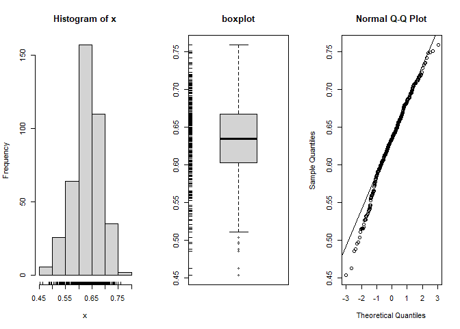<!-- -->

``` r
simple.eda(virginica_data$log10petal_length)
```

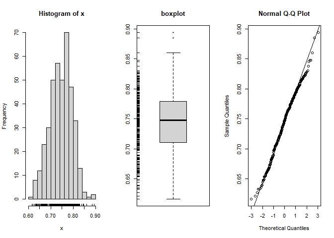<!-- -->
By separating the data by species, we find that the log transformation
of petal length is now normally distributed. Therefore, it is always
important to check the log transformation of a given variable and
confirm that it properly transformed the data into a normal
distribution.

# Running Data Analysis

## Form a Question:

At this point in your analysis you will be investigating the
interactions between variables. You should start by formulating a
question you might have about the dataset - For instance, you could
choose to focus on one of the 3 species featured in the dataset.
Noticing that *Iris setosa* inhabits three different soil types - loamy,
sand, and clay - you might want to investigate if there is any
relationship between soil type and petal length in *I. setosa*. You
could then look for relationships between soil and petal width as well
as soil and petal total area. Maybe you want to extend that to elevation
too. Once you have a question in mind you can decide what tests might
best serve your investigation best.

This is a large set so I’m going to use a pairplot to see if there are
any relationships that catch my interest:

``` r
library("GGally")

ggpairs(iris.raw.data, # calls ggpairs and tells it to use our iris dataset
  columns = 4:7, # Tells R that we are only looking to visualize colums 4-7 
  aes(color = species, alpha = 0.5), # Tells R that we want to color the graph by the species type so we can visualize the species differences
  upper = list(continuous = "points", position = "jitter")) + # This adds the scatter plots 
  theme_cowplot() #This applies the cowplot theme which makes the plot look a little neater by doing things such as removing the usual grey grid background.
```

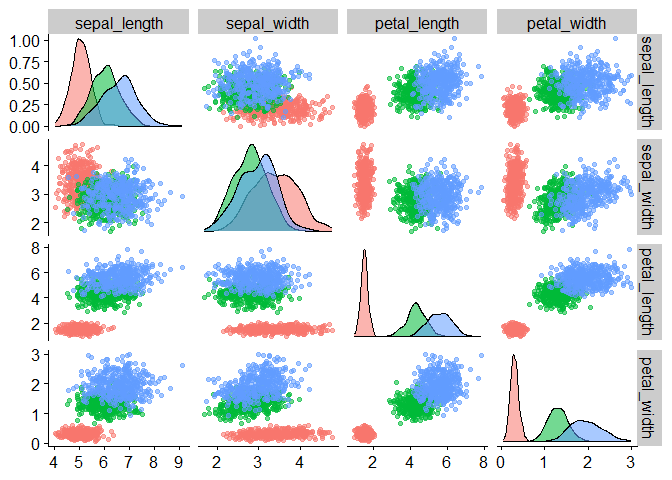<!-- -->

The above code first loads GGally which is an extension of ggplot2, a
preferred package for creating graphs. The ggpairs plot outputs a
scatterplot matric that gives us a great initial summary visualization.
We’re missing some of our variables such as elevation and soil type for
the sake of visual clarity but this allows us a quick glance into some
of the relationships that might exist within the data set.

The example hypothesis will be ‘soil type has a significant affect on
the length of *I. setosa* petals.’

**Your Turn:**

- Look at the summarized data as well as the pairplot and formulate a
  question or hypothesis you want to test.

## The T.Test

T.Tests are statistical tests that are used to compare the means between
two groups of data. This is useful in hypothesis testing because we can
use a t.test to determine whether or not a factor or treatment actually
has a significant effect on a population or group. It can also tell us
whether or not two groups are different from one another. This test
makes the following assumptions:

1.  The data is continuous
2.  The data set has been obtained by random samples from a population
3.  The variability of the data in each group is similar
4.  The distribution is approximately normal

To perform the t.test, you will first form a null hypothesis. The null
hypothesis should state that what you are investigating has no
significant effect on the population you are investigating.

In the case of the Iris petals, we will say that Soil type X does not
have any affect on the length of *I. setosa* petals.

We have already filtered our data by species so we can grab our *I.
setosa* data.

Now for the sake of demonstration since we need 2 variables, lets say
we’re only interested in comparing loamy and sandy soils. We’re
conducting an experiment in house and we can’t replicate clay, so we are
only interested in loam and sand. We will then filter out clay from the
data set. The \| operator acts as “or” which means it will pull out
loamy or sandy rows but not clay.

``` r
setosa_soil_data <- setosa_data |> 
  filter(soil_type=="loamy" | soil_type=="sandy")
summary(setosa_soil_data$soil_type)
```

    ##  clay loamy sandy 
    ##     0   123   118

**Your Turn:**

- Perform any filtering or arranging you might need to do here:

- State your null hypothesis:

We will now perform the T Test:

``` r
t.test(log10petal_length ~ soil_type, data = setosa_soil_data)
```

    ## 
    ##  Welch Two Sample t-test
    ## 
    ## data:  log10petal_length by soil_type
    ## t = -1.1968, df = 228.98, p-value = 0.2326
    ## alternative hypothesis: true difference in means between group loamy and group sandy is not equal to 0
    ## 95 percent confidence interval:
    ##  -0.023350928  0.005703817
    ## sample estimates:
    ## mean in group loamy mean in group sandy 
    ##           0.1719386           0.1807621

The example t.test returned a p-value of 0.2326. The p-value tells us
the likelihood that you might observe the modeled outcome in your data
set given that the null hypothesis is true. We will reject the null
hypothesis if p \< 0.05. Given our test returned a p-value of 0.7936, we
can not confidently say amongst clay or sandy soil that soil type
affects the length of petals in *I. setosa* so we fail to reject the
null hypothesis.

**Your Turn:**

You will now run the t.test. Use the above sepal/soil test code as a
guide to test your hypothesis.

- Interpret your t.test below:

## Analysis of Variance (ANOVA) Test

Anova tests follow the same principle as t-tests but they are used when
you have more than 2 groups. It can also be used to compare nested
models.

So, returning to our soil and petals test we can add clay back into the
mix! We will therefore use our filtered setosa data set rather than the
soil filtered set.

Our null hypothesis is that there is no difference in the means of the
different layers (petals at each soil type).

``` r
SepalSoilaov <- aov(setosa_data$log10petal_length~setosa_data$soil_type)
summary(SepalSoilaov)
```

    ##                        Df Sum Sq  Mean Sq F value Pr(>F)
    ## setosa_data$soil_type   2 0.0079 0.003945   1.268  0.283
    ## Residuals             397 1.2352 0.003111

Our p-value is 0.283 and so we again fail to reject the null hypothesis,
it does not seem like soil type has a significant effect on petal
length.

**Your Turn:**

Perform an Anova test below and interpret your results:

## Linear Modeling

Linear modeling looks for direct correlations between variables. It is a
parametric test and assumes:

1.  The relationship between x and the mean of y is linear
2.  That the observed data points are independent of each other
3.  That the data is normally distributed
4.  Homoscedasticity - That the spread of data variance is approximately
    the same

Lets investigate a new question, since there was no significance in
petal/soil data, lets investigate the relationship between petal length
and width since it seemed like there might be a linear correlation
between the two in the pairplot. We can investigate this with a linear
model.

``` r
lmSetosaPetalLW <- lm(log10petal_length ~ log10petal_width, data = setosa_data)

summary(lmSetosaPetalLW)
```

    ## 
    ## Call:
    ## lm(formula = log10petal_length ~ log10petal_width, data = setosa_data)
    ## 
    ## Residuals:
    ##       Min        1Q    Median        3Q       Max 
    ## -0.193647 -0.033368  0.003861  0.035846  0.129706 
    ## 
    ## Coefficients:
    ##                  Estimate Std. Error t value Pr(>|t|)    
    ## (Intercept)       0.17085    0.01046  16.339   <2e-16 ***
    ## log10petal_width -0.01422    0.01859  -0.765    0.445    
    ## ---
    ## Signif. codes:  0 '***' 0.001 '**' 0.01 '*' 0.05 '.' 0.1 ' ' 1
    ## 
    ## Residual standard error: 0.05585 on 398 degrees of freedom
    ## Multiple R-squared:  0.001468,   Adjusted R-squared:  -0.001041 
    ## F-statistic: 0.5851 on 1 and 398 DF,  p-value: 0.4448

We have returned a p-value of 0.445 so it does not seem like there is a
lot of correlation within *I. sentosa*. Our pair plot did include all of
the species, so what does our model look like if we broaden it a little
and look at all three of the Iris species?

``` r
lmIrisPetalLW <- lm(log10petal_length ~ log10petal_width, data = iris.raw.data)

summary(lmIrisPetalLW)
```

    ## 
    ## Call:
    ## lm(formula = log10petal_length ~ log10petal_width, data = iris.raw.data)
    ## 
    ## Residuals:
    ##      Min       1Q   Median       3Q      Max 
    ## -0.34307 -0.05313  0.00110  0.05830  0.50411 
    ## 
    ## Coefficients:
    ##                  Estimate Std. Error t value Pr(>|t|)    
    ## (Intercept)      0.549551   0.002588  212.36   <2e-16 ***
    ## log10petal_width 0.628831   0.006897   91.18   <2e-16 ***
    ## ---
    ## Signif. codes:  0 '***' 0.001 '**' 0.01 '*' 0.05 '.' 0.1 ' ' 1
    ## 
    ## Residual standard error: 0.08886 on 1198 degrees of freedom
    ## Multiple R-squared:  0.874,  Adjusted R-squared:  0.8739 
    ## F-statistic:  8313 on 1 and 1198 DF,  p-value: < 2.2e-16

This returns a p-value of 2e<sup>-16</sup> which is below p=0.05 so we
can reject the null hypothesis and say that within these three Iris
species, there does appear to be correlation.

**Your Turn:**

Determine if your data fits the requirements for linear modeling and
perform your own tests below:

## Visualization

Now what does this look like? Visualizations are an important part of
understanding our data. Visualizations allow us to see a better picture
of the story the data tells. It allows us to find identify and recognize
trends, outliers, and patterns within the dataset. It is also an
important tool for presenting your data to other people. This tutorial
will give a brief overview of data visualization. We are going to use
the ggplot package, a package dedicated exclusively to data
visualization so you can quickly make visually appealing and effective
graphs.

Lets start by making a quick graph to take a look at the relationship
between our log transformed petal length and petal width of *I. setosa*.

``` r
ggplot(setosa_data) + # This calls ggplot and tells it we're using the setosa dataset.
  aes(x = log10petal_length, y=log10petal_width) + # This sets our x and y axis with the variables we are looking to explore
  geom_point(position = "jitter",size=1) + # This sets up our scatter plot and adds jitter which, basically, spreads our points out and makes them easier to see
  theme_cowplot()+ # Good ol' cowplot from before
   geom_smooth(method='lm',se=FALSE) # This adds our trend line
```

    ## `geom_smooth()` using formula = 'y ~ x'

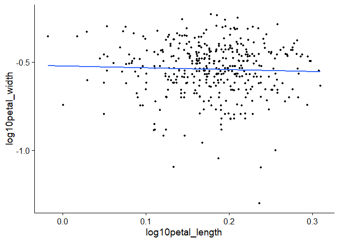<!-- -->

This graph confirms what our p-values told us before, there does not
appear to be any linear relationship between petal length and width in
*I. setosa*.

But we did see a significant p-value when we looked at petal length and
width in the whole *Iris* set so lets take a look at that relationship.

``` r
ggplot(iris.raw.data) + # Same as before but this time we're calling the entire iris dataset
       aes(x=log10petal_length, y=log10petal_width, color = species) +  # Same as before but now like we did with GGally, we're telling it we want to color the points by the Iris species
  geom_point(position = "jitter",size=1) + # Same as the last graph
  geom_smooth(method = lm, color="black") + # This is the same but this time we are telling it we want to make the trendline black
  theme_cowplot() # And once more, good ol' cowplot
```

    ## `geom_smooth()` using formula = 'y ~ x'

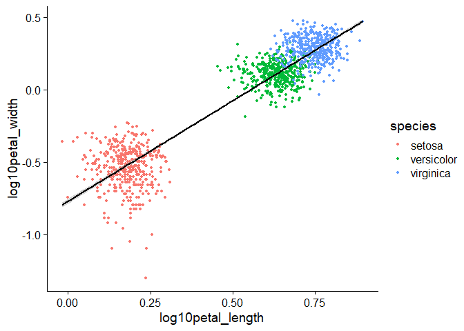<!-- -->

Similar to what we saw in the GGally plot, we can see that, as the
p-value indicated, there does seem to be a linear relationship between
petal width and length between these species. If we were to analyze this
further, we could try to see if we could find something that might
explain the difference such as looking at the soil and elevation data.
There are also many different graphs to make and ways to make them look
better such as changing the title and axis names, orienting your axis
value positions, and changing the colors of the data. For now, it’s…

…**Your Turn!:**

- What does your data look like? Make your own graph below

# Tutorial Summary

### Purpose of each type of test:

**One-way anova** - One-way ANOVA is used to determine if there are
statistically significant differences between the means of three or more
independent groups. It helps you understand if at least one group
differs from the others, but it doesn’t tell you which specific groups
differ.

- Ex: You want to compare the mean sepal_length between different
  Species to check if any species has significantly different sepal
  lengths.

*Note that If the ANOVA result is significant, post-hoc tests (e.g.,
Tukey’s HSD) can determine which groups are different from each other.*

**t-test** - The t-test is used to compare the means of two groups.
There are two common types:

- **Independent t-test** - Compares means between two independent groups
  (e.g., sepal_length for “setosa” vs. “versicolor”).

- **Paired t-test** - Compares means of the same group at different
  times or conditions. You have two independent groups (e.g., comparing
  two species) and a continuous variable (e.g., sepal_length).

  - Ex: Comparing the mean sepal_length between two species.

**simple linear regression** - Simple linear regression models the
relationship between two continuous variables. It is used to predict the
value of a response variable (dependent) based on the value of an
explanatory variable (independent).

You want to predict one continuous variable (e.g., sepal_length) from
another continuous variable (e.g., petal_length).

- Ex: You want to predict sepal_length from petal_length.

*Note: This will provide an equation for the linear relationship between
the two variables, which you can use for prediction. The summary()
function will give you important statistics like the slope, intercept,
and R-squared value (which shows how much of the variation in the
response variable is explained by the explanatory variable).*

**simple eda** - Exploratory Data Analysis (EDA) is the process of
analyzing data sets to summarize their main characteristics using
visualizations and statistical methods. The goal is to better understand
the structure of the data, detect patterns, spot anomalies, and test
initial hypotheses.

## When to Use What Test:

At the beginning of a data analysis project to explore your dataset and
get a sense of its structure.

- Ex: Summary statistics: summary(data) to get a quick overview of the
  distribution of your variables.
- Ex: Visualizations: Scatter plots, box plots, histograms, and
  correlation matrices.

**Normality test(shapiro.test)** - The Shapiro-Wilk test is used to test
for normality. It assesses whether a sample comes from a normally
distributed population. Many statistical tests (like ANOVA and t-tests)
assume that the data is normally distributed, so testing for normality
is a common step.

When to Use: Before running parametric tests like ANOVA, t-tests, or
linear regression, where the assumption of normal distribution is
crucial.

- Ex: You want to test if the sepal_length is normally distributed.

*Note:* *If the p-value is greater than 0.05, the data is approximately
normal.* *If the p-value is less than 0.05, the data significantly
deviates from normality.*

------------------------------------------------------------------------

# Acknowledgements

I modified this code to create the code to read the csv in directly from
github: <https://lokraj.me/post/download-github-data/>

I utilized this site for t.test clarification
<https://www.jmp.com/en_us/statistics-knowledge-portal/t-test.html>

For the discussion of the purpose for normal distibutions and
transforming data so it is normally distributed, the following article
was used.

For the explanation of the mutate() function
<https://dplyr.tidyverse.org/reference/mutate.html>

Citation: Mishra, P., Pandey, C. M., Singh, U., Gupta, A., Sahu, C., &
Keshri, A. (2019). Descriptive statistics and normality tests for
statistical data. Annals of cardiac anaesthesia, 22(1), 67–72.
<https://doi.org/10.4103/aca.ACA_157_18>

Parts:

- Tutorial Introduction, objectives, and introduction were done by Kayla
  and Rebecca
- Instructions were done by Kayla with a couple packages added by
  Rebecca
- Importing the dataset was done by Kayla (first import code, head,
  tail, nrow, glimpse, NAs) and Rebecca (online download code, NAs)
- Jayden did the Looking into different variables section, Rebecca
  assisted with factoring code
- Exploratory Data Analysis section done by Kayla, Rebecca assisted with
  filtering code
- Running Data Analysis section done by Rebecca
- Summary done by Jayden
- Formatting done by Rebecca
